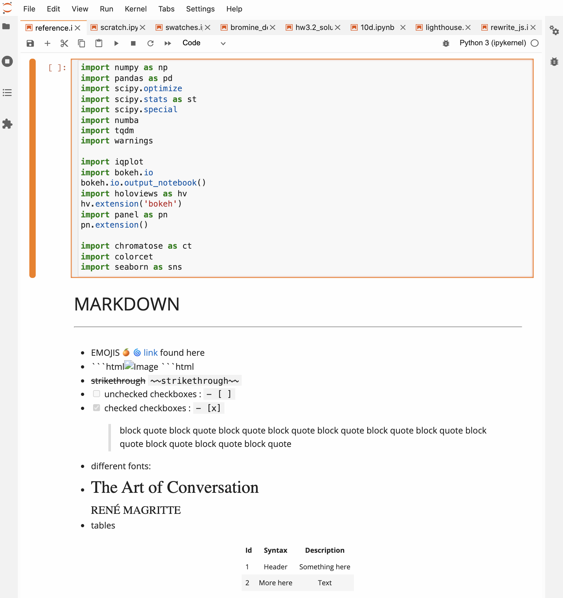
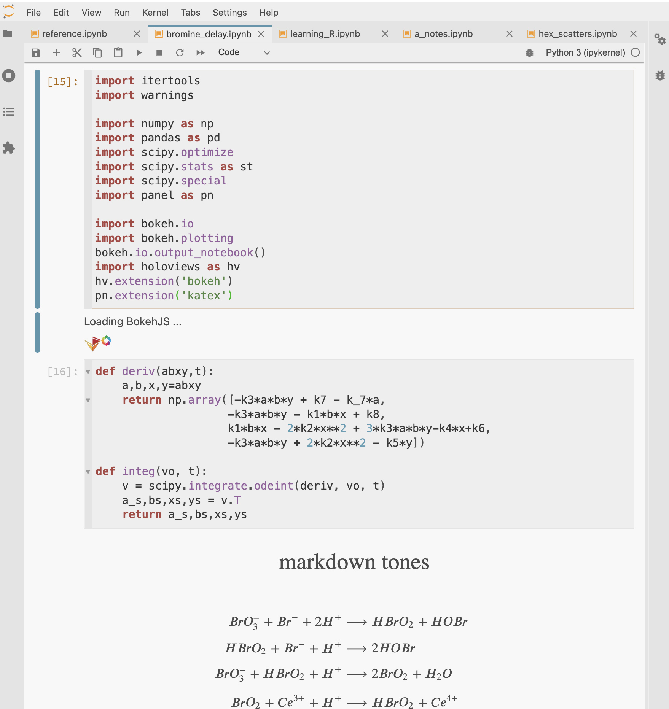
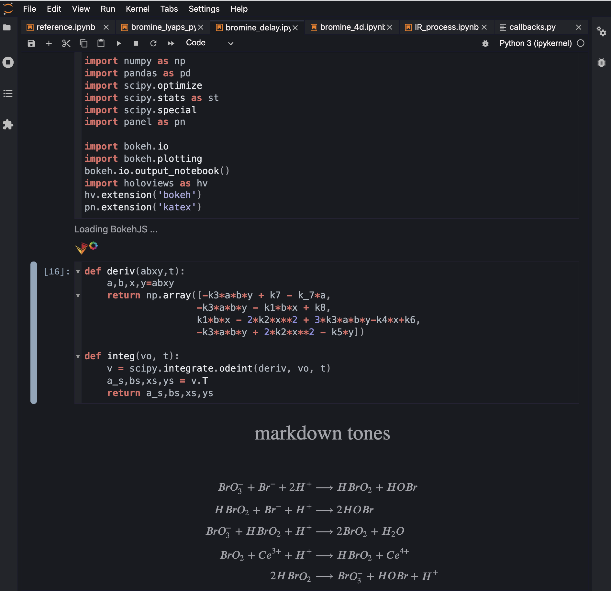
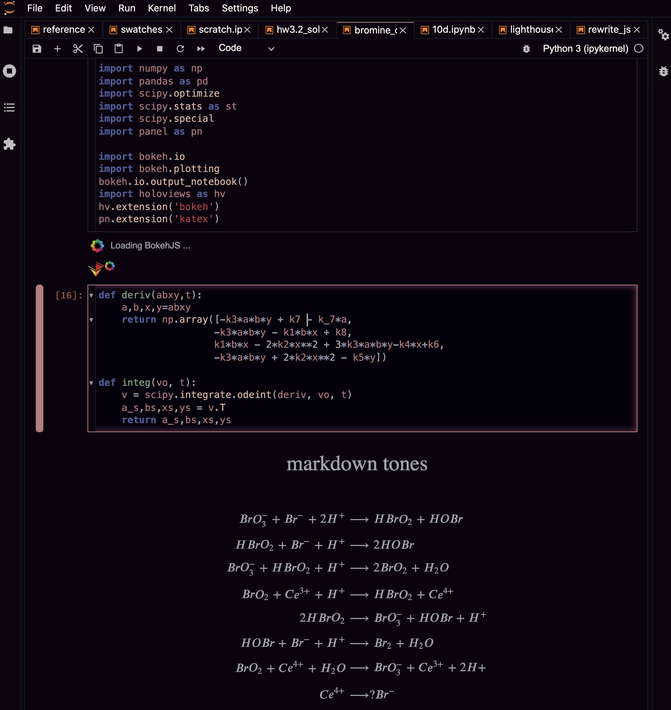

# jupyterlab-themes

The structure for this repo is forked from [arbennett/jupyterlab-themes](https://github.com/arbennett/jupyterlab-themes). I've collected and modified four themes from various places, two light: **mandarin-light** (custom) and **mexico-light** (base-16), and two dark: **frantic-contrast** (rainglow), and **rouge-dark** (rainglow). 


## Installation

Each theme exists as a separate npm package that can be installed via `npm` with the standard way of installing lab extensions:

```
jupyter labextension install @atisor73/{$themename}
```


You can also install from source by running the following comands in a theme's respective subdirectory:

```
npm install
jupyter labextension link .
```


## Example screenshots

### mandarin-light


### mexico-light




### frantic-contrast




### rouge-dark




## Process (note-to-self)

**Creating a new theme:**

- copy the following from an existing theme: 
  -  `pacakage.json` 
  -  `src/`
  - `style/`
  - `tsconfig.json`
  - `webpack.config.js`
  - `yarn.lock`

- change `package.json` fields: name, version, typescript version (last functioning 3.9.2)

- change `src/index.ts` plugin id, style constant variable filepath, and registered name

- make sure `tsconfig.json` has "exclude": ["node_modules"], and "compilerOptions": {"skipLibCheck": true}

- edit `style/variables.css` 

  

**Viewing the theme:**

- Development install:

```bash
$ cd {theme-name-dir}/
$ npm install 
$ jupyter labextension link .
```

- Rebuild package and JupyterLab:

```bash
$ npm run build
$ jupyter lab build
```


**Editing themes:**

- change `style/variables.css` 


**Publishing themes:**

- check/update version numbers in package.json

```bash
$ npm login
$ npm publish
```


**To disable extensions:**

```bash
$ jupyter labextension disable base16-nord
```


**New fonts to consider:**

"Menlo" vs. "Input mono"

```css
/* previously: */
--jp-code-font-family-default: Menlo, Consolas, 'DejaVu Sans Mono', monospace;

/* updated: */ 
--jp-code-font-family-default: Input Mono, Menlo, Consolas, Monaco, 'Lucida Console', 'Liberation Mono', 'DejaVu Sans Mono', 'Bitstream Vera Sans Mono','Courier New', monospace, serif;

/* personal content preference for Open Sans */
--jp-content-font-family: 'Open Sans', 'Open Sans', BlinkMacSystemFont, 'Segoe UI', Helvetica, Arial, sans-serif, 'Apple Color Emoji', 'Segoe UI Emoji', 'Segoe UI Symbol';
```


Other [rainglow](https://rainglow.io/) themes to convert: 

- bold/bold contrast
- crisp contrast
- brave contrast
- comrade light/contrast 

- dare contrast
- goldfish contrast
- laracast contrast
- laravel contrast
- solarflare contrast
- stasis contrast
- tribal contrast
- turnip contrast
- tweed contrast
- vegetable contrast
- warlock contrast
