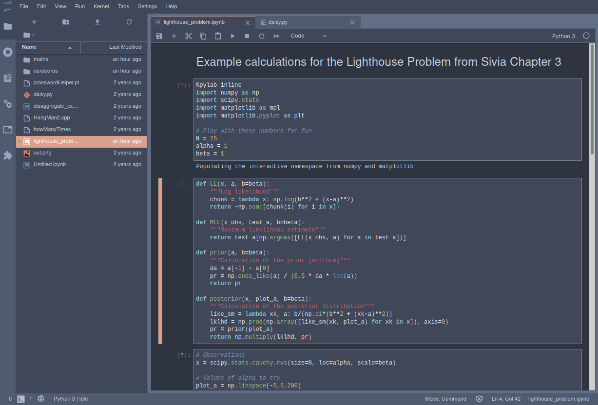
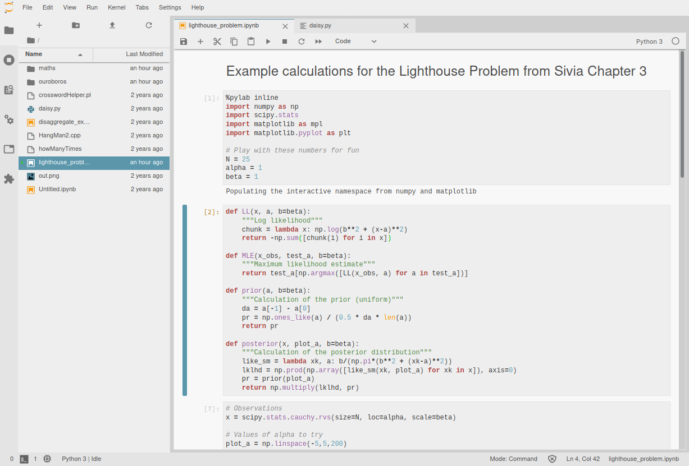

# jupyterlab-themes

Forked the repo structure from [arbennett/jupyterlab-themes](https://github.com/arbennett/jupyterlab-themes).

## Installation
Currently, you have to install each of the themes individually. Themes be installed directly via `npm` with the standard way of installing lab extensions:

```
jupyter labextension install @atisor73/{$themename}
```

You can also install from source. This can be accomplished by running the following comands in a theme's respective subdirectory:

```
npm install
jupyter labextension link .
```

## Example screenshots

### Mandarin Light theme


### Rogue Dark theme

